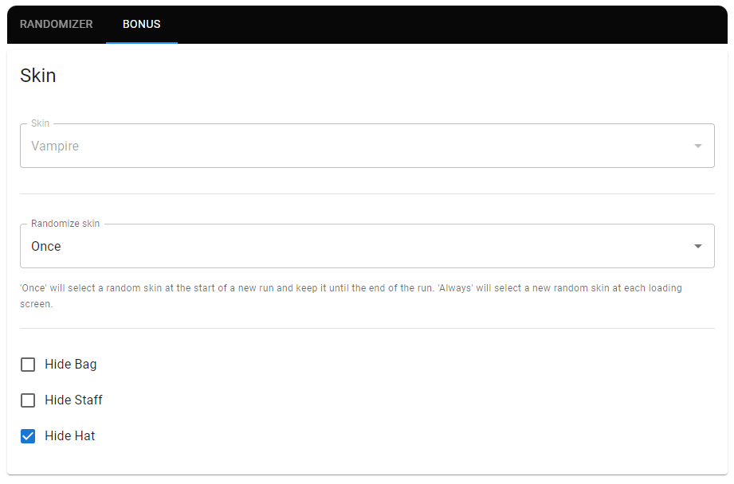

# Randomized Witch Nobeta


> A **Little Witch Nobeta** randomizer that aims to bring a new game experience with a multitude of new mechanics and settings

# Documentation

- [What is a randomizer ?](#what-is-a-randomizer-)
- [Compatibility](#compatibility)
- [Installation](#installation)
- [Game modifications](#game-modifications)
- [Features/Settings](#featuressettings)
  - [Locations Randomization](#locations-randomization)
  - [Chest Content Randomization](#chest-content-randomization)
  - [End Screen](#end-screen)
  - [Boss Hunt and Magic Master](#boss-hunt-and-magic-master)
  - [Trial Keys](#trial-keys)
  - [No Arcane](#no-arcane)
  - [Magic Upgrades](#magic-upgrades)
  - [Extra loots](#extra-loots)
  - [Bonus](#bonus)
- [Building](#building)
- [Bug report and help](#bug-report-and-help)
- [Contributing](#contributing)
- [Used libraries](#used-libraries)
- [Licence](#licence)

## What is a randomizer ?

A randomizer is a tool that aim to add replayability to games by randomly arranging a game data. it can alter item placement, level locations, enemies, anything that can bring a new interest in the game. A general definition with examples can be found here: [Video Game Randomizer](https://tvtropes.org/pmwiki/pmwiki.php/Main/VideoGameRandomizer).

This randomizer is capable of generating seeds that randomize locations and chest content but also adds a lot of new game mechanics to make each run unique and enjoyable.  
The game balance was and is heavily considered during the development of this randomizer, it can be enjoyed by casual to experimented players all the same thanks to a lot of balance settings. A run difficulty can be tweaked to match anyone preferences. Furthermore, a run can be resumed at anytime so no need to do everything in one sitting!

## Compatibility

This randomizer is only compatible with the **latest version of the game** _(1.1.0 at the time of writing this)_. No support is given for older versions of the game.

## Installation

This plugin modifies the game using [BepInEx](https://github.com/BepInEx/BepInEx), so it is needed to install BepInEx to load this plugin, here are the steps to achieve this:
- Find the installation directory of the game *(Usually in `steamapps/common`, you can find this from the game properties in steam -> local files -> browse...)*
- **/!\ Do a copy of your game installation and rename it `Little Witch Nobeta - Randomizer`** *(The changes are reversible but a pain to do, furthermore it's easier to have two versions of the game, one with the randomizer and the base one)*
- You should now have at least two folders in the `steamapps/common` directory: `Little Witch Nobeta` *(base game)* and `Little Witch Nobeta - Randomizer` *(will be modded with the Randomizer)*
- Download the randomizer: [**`RandomizedWitchNobeta.zip`**](/../../releases/latest/download/RandomizedWitchNobeta.zip)
- Copy all the files from the archive inside the game directory *(Where there is `LittleWitchNobeta.exe`)*
- Now you should see a file named `winhttp.dll` just next to `LittleWitchNobeta.exe`
- Create a shortcut to `LittleWitchNobeta.exe`, name it as you want, run the game and enjoy!

A correct installation directory content should look like this:
```
.
├── BepInEx
├── dotnet
├── LittleWitchNobeta_Data
├── GameAssembly.dll
├── LittleWitchNobeta.exe
├── UnityCrashHandler64.exe
├── UnityPlayer.dll
├── baselib.dll
├── changelog.txt
├── doorstop_config.ini
└── winhttp.dll
```

## Game modifications

Some modifications have been done to the game to allow randomization of the game without issues:
- It is possible to teleport to any unlocked statue at any progression point in the game _(that means it's possible to go in/out of the Spirit Realm at any time)_
- Statues are auto-unlocked when passing by them, no need to "pray" _(avoids soft-locking by leaving an area prematurely)_
- Vanessa does not give thunder when killed for the second time _(in Spirit Realm)_
- Doors at the start of Lava Ruins and Dark Tunnel are locked
- **All doors can be accessed both ways: all the gates blocking their access are always open** _(so killing the Armor is not the only exit of Okun Shrine)_

## Features/Settings

Every feature of this randomizer can be tweaked before starting a run, those settings can also be easily shared with other players to organize races on the same seed/generation.  
Any combination of settings will always generate a completable seed, meaning it's possible to reach Nonota and kill her to get the end credits _(unless the verification algorithm has a bug, please report it if you ever find an uncompletable seed!)_

To organize a race where all players are playing with the same settings and the same seed:
- Make sure everyone is using the same version of the randomizer! _(The version is displayed next to the game version in the title screen)_
- Tweak the settings as you want them to be in the automatically opened browser page
- Click on 'Export to Clipboard'
- Paste the generated text where other people can copy it _(discord, messenger, ...)_
- Other players can copy the generated text and then click on 'Import from Clipboard'
- Settings should be updated to match the exported ones on import.

At the end of a run, the 'hash' of the seed is displayed: this number is unique to each seed, this means that if all players that are playing on the same seed should see the same hash displayed. If this is not the case, it means that the settings were not imported correctly or that players are using different versions of the randomizer. It is also possible to see the seed hash before starting a run, just above the copyright text on the bottom center of the title screen.

> The settings window is only visible on the title screen, it automatically hides when starting/resuming a run.

### Locations Randomization

It is possible to randomize the **start level** and the **destinations of doors/post-cutscene level changes**. A level will always be started from it's beginning area even when taking doors to avoid unpredictable behaviors of the game.

It is possible that some areas are not accessible at all for a specific seed since location shuffle is completely random.

### Chest Content Randomization

Chest content is randomized according to other settings. Chests will always contain the required items to complete the game, and then other chests are filled with other items like crystals. It is possible to tweak the weights of those fill items in the settings.

The cat in _'Okun Shrine - Underground'_ that usually gives absorb will instead give a random item, don't forget to take it on your way to Tania! _(if you forgot to talk to her, she will always drop the item just before the last statue in this level, down the stairs)_

### End Screen

The end screen message is modified to show the time needed to complete a run and the seed hash used to check fairness in races. This screen is always shown after the credits but the timer stops when Nonota is killed, this means that watching the credits doesn't impact the timer even in races.


> Example of an end screen after completing a run

### Boss Hunt and Magic Master

Those two settings add new conditions before being able to unlock the teleport to Nonota and end the game:
- **Magic Master:** All attack magics _(arcane, ice, fire and thunder)_ must be Lvl. Max _(Lvl. 5)_
- **Boss Hunt:** All bosses need to be killed _(this does not include "elite" enemies like the Seal, but don't forget the one in Secret Passage that **is** a boss)_

### Trial Keys

Enabling this setting will add keys that are required to open the teleports to each trial. Opening a trial is done by dropping a key on a trial path, this action will consume the key so it is needed to get at least 3 keys before being able to end the game.

The number of keys in the item pool can be changed, putting less keys in the item pool tend to make runs longer and harder by needing to explore more areas and opening more chests.

> A legendary speedrunner of Little Witch Nobeta recommends playing with 5 keys in the item pool as it is a good middle ground between finding them too easily or not finding them at all.

### No Arcane

It is possible to start without Arcane, this means that only melee attacks are possible. When the `No Arcane` setting is enabled, Arcane will still show in the UI but it will be impossible to fire Arcane shots before unlocking it like any other magic.

### Magic Upgrades

Magic upgrades is referring to the way of magic of a certain type increase in level, for example going from `Thunder lvl. 3` to `Thunder lvl. 4`.

At the moment, there are two different magic upgrade modes:
- **Vanilla:** This is how it is done in the game originally, to increase the level of a certain magic type, it is needed to find multiple books of the same magic type.
- **Boss Kill:** In this mode, there will be **only one book of each type of magic** in the item pool. Each time a boss will be killed, the overall level of all type of magics will increase by one _(but they won't be unlocked until the corresponding book is found)_.

Playing in **Boss Kill** mode can lead to interesting runs because it is harder to find all magic books, thus forcing the player to use other type of magics than what they are used to.

### Extra loots

In addition to magic crystals, it is possible to find souls in chests and given by the cat, the amount of souls given can be changed and the apparition of those souls in chests can be disabled by **setting a weight of 0** to **Souls** in the **'Item Pool Weights'** settings.

### Bonus

A **'Bonus'** tab is available in the randomizer settings window, containing small tweaks _(mostly visual)_ that do not impact gameplay.



> Bonus tab with skin settings

## Building

To build the Randomizer as a working BepInEx plugin, two steps are required:
- Clone this repository and make sure .Net 6.0 SDK is installed
- Get the required interop files generated by BepInEx and include it in the `lib/interop` directory

The easiest way to generate the needed interop files is to install the randomizer as explained in [**installation**](#installation). The generated interop files can be found in the root game folder under `BepInEx/interop`.

Once those two steps are done, the randomizer can be built using either the dotnet CLI or your preferred IDE. The output will be a `.dll` file that needs to be placed in the directory `BepInEx/Plugin/RandomizedWitchNobeta`.

In addition, the web settings ui can be built using the `buildui.fish` script located in the web settings project. The code itself can be updated by running the `publish.fish` script. To update the web settings after a ui and code change, it is required to replace the `RandomizedWitchNobeta.WebSettings.exe` and `wwwroot` files/directories. It is not required to build the web settings manually when modifying the randomizer, it is only required when adding new settings.

## Bug report and help

If you found a bug, need help with the Randomizer or want to suggest a new feature, you can either [open a new issue](/../../issues) or you can find me on the [Little Witch Nobeta Speedruns Discord](https://discord.gg/3FMeB4m).

Please send a copy of the log file in `BepInEx\LogOutput.log` in case you found a bug before starting the game again to help me diagnose the issue.

## Contributing

This repository accepts contributions, don't hesitate to [open a new issue](/../../issues) before doing a pull request for major changes or new features.

## Used libraries

This Trainer tool couldn't be made without these awesome libraries and tools:
- [BepInEx](https://github.com/BepInEx/BepInEx) - *licensed under the LGPL-2.1 license*
- [Json Forms](https://github.com/eclipsesource/jsonforms) - *licensed under the MIT license*
- [Humanizer](https://github.com/Humanizr/Humanizer) - *licensed under the MIT license*
- [Weighted Item Randomizer for C#](https://github.com/BlueRaja/Weighted-Item-Randomizer-for-C-Sharp) - *licensed under the MIT license*

## Licence

*This software is licensed under the [MIT license](LICENSE), you can modify and redistribute it freely till you respect the respective [Used libraries](#used-libraries) licenses*
